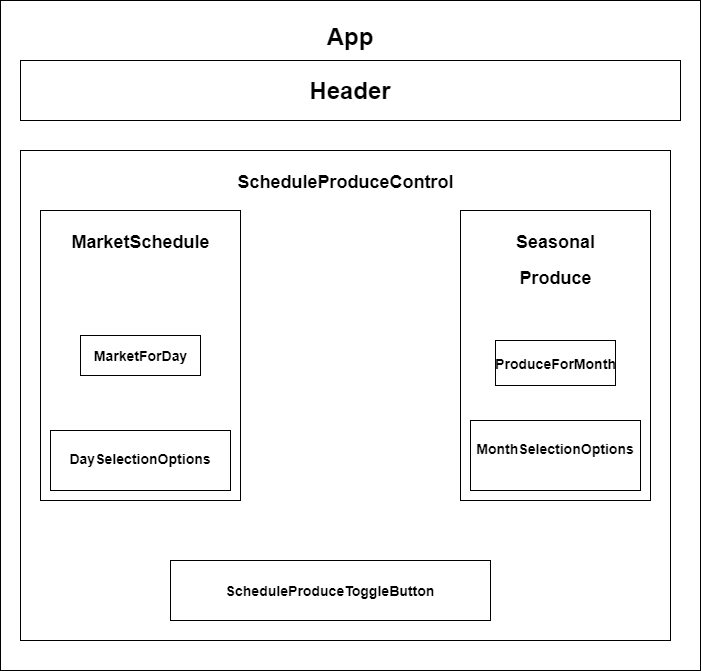

# Farmers Market
#### Learning project for Epicodus course: Website for a Farmer's Market with React
#### By Shanen Cross and Karlson Drendel

## Project Description

Learning project to develop a simple website with state using React. Website is for a Farmer's Market. /* TODO */

# Component Diagram

## Technologies Used
/* TODO */

## Set up / Installation requirements
/* TODO */

## Known Bugs
* No known bugs

## License
* [MIT](https://choosealicense.com/licenses/mit)
* Copyright 2021 Shanen Cross and Karlson Drendel
